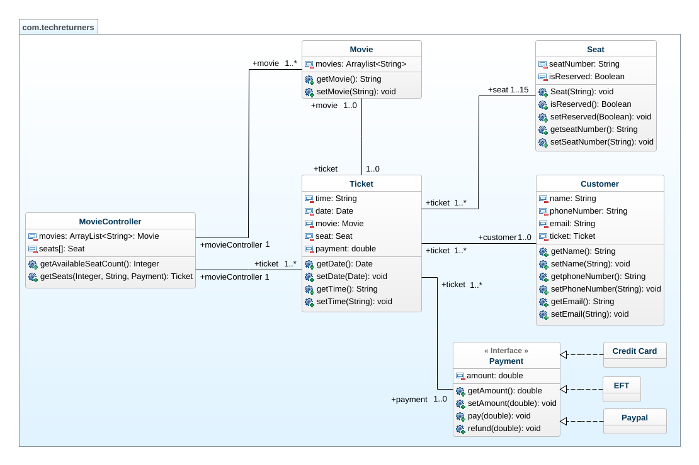

# CINNAMON CINEMAS
> Brief  
> Allocate seats to customers purchasing tickets for a movie theatre.
## Table of contents
* [Acceptance criteria and assumptions](#acceptance-criteria-and-assumptions)
* [Technologies](#technologies)
* [How to run the project](#how-to-run-the-project)
* [UML diagram](#uml-diagram)
## Acceptance Criteria and Assumptions
- The Cinnamon Cinemas Movie Theatre has 15 seats, arranged in 3 rows of 5
- Rows are assigned a letter from A to C
- Seats are assigned a number from 1 to 5
- Allocate seats based on a random integer “number of seats” between 1 and 3
- Allocate the required number of seats from the available seats starting from seat A1 and filling the auditorium from
left to right, front to back
- All the seats are available for sale when the program starts
- The program should continue to allocate a random number of seats until it finds there are not enough seats left to complete the request
- Once there are not enough seats available to be allocated then the program can halt
## Technologies
- java version 17
- apache-maven-3.9.0
## How to run the project
- On the command line execute :  
  `mvn clean compile test`
## UML diagram

